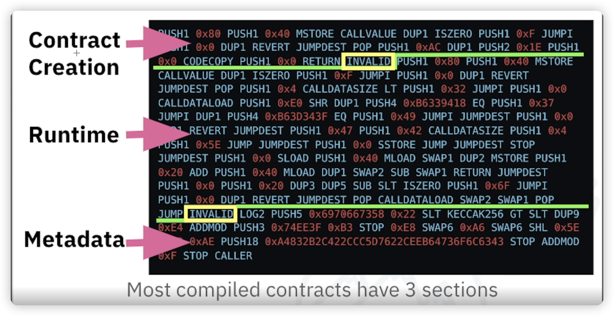

# Intro
---

EVM 只是一个计算引擎，因此提供了计算和存储的抽象，例如类似于 Java 虚拟机 (JVM) 规范。从高层次的角度来看，JVM 旨在提供与底层主机操作系统或硬件无关的运行时环境，从而实现跨各种系统的兼容性。 
因此，EVM 没有调度功能，因为执行顺序是在其外部组织的——以太坊客户端通过经过验证的块交易运行来确定哪些智能合约需要执行以及按什么顺序执行。从这个意义上说，以太坊世界计算机是单线程的，就像 JavaScript 一样。 EVM 也没有任何“系统接口”处理或“硬件支持”——没有可以连接的物理机器。以太坊世界计算机是完全虚拟的。

# Level-1
---
## 堆栈
EVM是基于堆栈的架构，将所有内存的值存储在了堆栈上。大小是256位。


## Transactions
交易是来自账户的加密签名指令。有两种类型的交:
1. 导致消息调用的交易
2. 导致合约创建的交易


## ByteCode
EVM ByteCode支持大部分的操作，包括了:
1. 算术运算
2. 上下文查询
3. 堆栈，内存和存储访问
4. 控制流程
5. Log，calling

## State

EVM 的工作是通过计算智能合约代码执行的有效状态转换来更新以太坊状态。
在最高级，我们有一些以太坊World State。World state是地址到账户的音社。
在低级别，每个地址代表一个账户，其中有余额，随机数(如果是 EOA，则表示从该帐户成功发送的交易数量，或者如果是合约账户，则包含其创建的合约的数量),账户的存储和程序代码。

- EOA始终没有代码，并且存储空间为空。

# Level-2
---
首先我们要明确几件事:
- 当EVM执行代码的时候，它总是自上而下的执行代码，也就是代码没有其余的入口点，总是从顶部开始.
- Creation Code是在transaction中执行的，会返回世纪的runtime code。
- 构造函数是Creation Code的一部分，而不是Runtime Code。
- 当部署构造函数中有参数的合约时，参数会作为原始十六进制数据附加到代码的末尾。
- 在执行函数体之前，函数的参数会被加载到堆栈中，以便接下来的代码可以使用它们

## More About Stacks

## Creation&Runtime Code
当部署一个合约的时候，一个合约会被编译成几段代码，Creation Code, Runtime Code, Metadata

## Fucntion Selector
当我调用合约函数的时候，我们会包含一些调用数据，用于指定我们正在调用的函数签名和需要传入的参数，在solidity中一般这么写:
```solidity
bytes memory functionCalldata = abi.encodeWitSignature("store(uint256)",10)
address(storageContract).call(functionCalldata);
```
functionCallData会返回:
```
0x6057361d000000000000000000000000000000000000000000000000000000000000000a
```
`0x6057361d`就是函数选择器，也是Keccak哈希值的前四个字节，后32个字节是我们的uint256输入参数

## Metadata Hash

# Level-3
---

## Memory

## Storage


